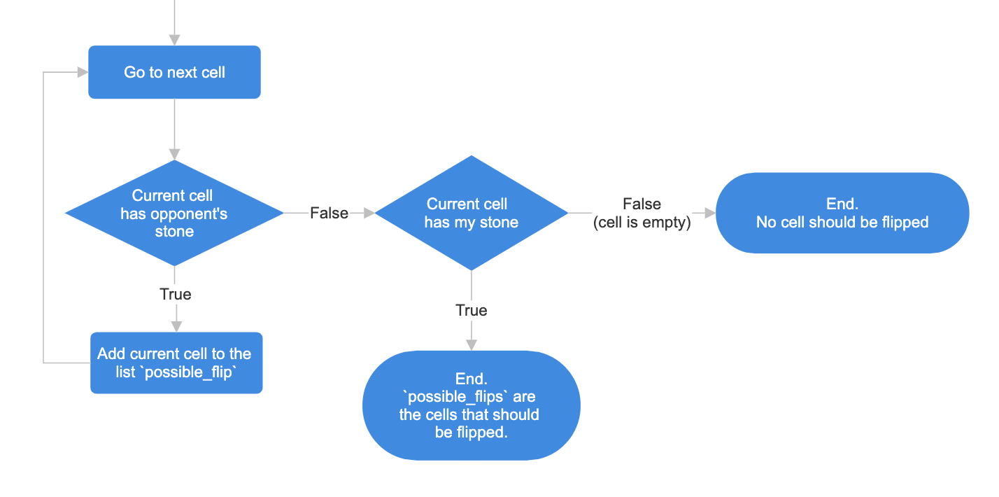

# Othello
### Background
I'm teaching my mother how to code in Python. One of the assignments was to write a playable game of CLI Othello, and this is my (model) implementation.

### Logic
Writing Othello involves some rather complicated logic for beginner programmers, especially dealing with 2D arrays and determining which stones should be flipped when. Drawing a flow chart can often be helpful to brainstorm and visualize the instruction flow.

#### Example flow chart for `get_cells_to_flip()`


### Example playback
```
 : 0 1 2 3 4 5 6 7
-------------------
0:                 
1:         +   +   
2:       + ○ ○ ○   
3:     + ○ ●       
4:       ● ○ +     
5:         +       
6:                 
7:  
```
```
 : 0 1 2 3 4 5 6 7
-------------------
0:       + ● + ● + 
1:     ○   ●   ●   
2:       ○ ● ○ ● + 
3: ○   + ● ● ●     
4: ● ● ● ● ● +     
5: +   ○ +   ●     
6:   ○             
7: ○               
```